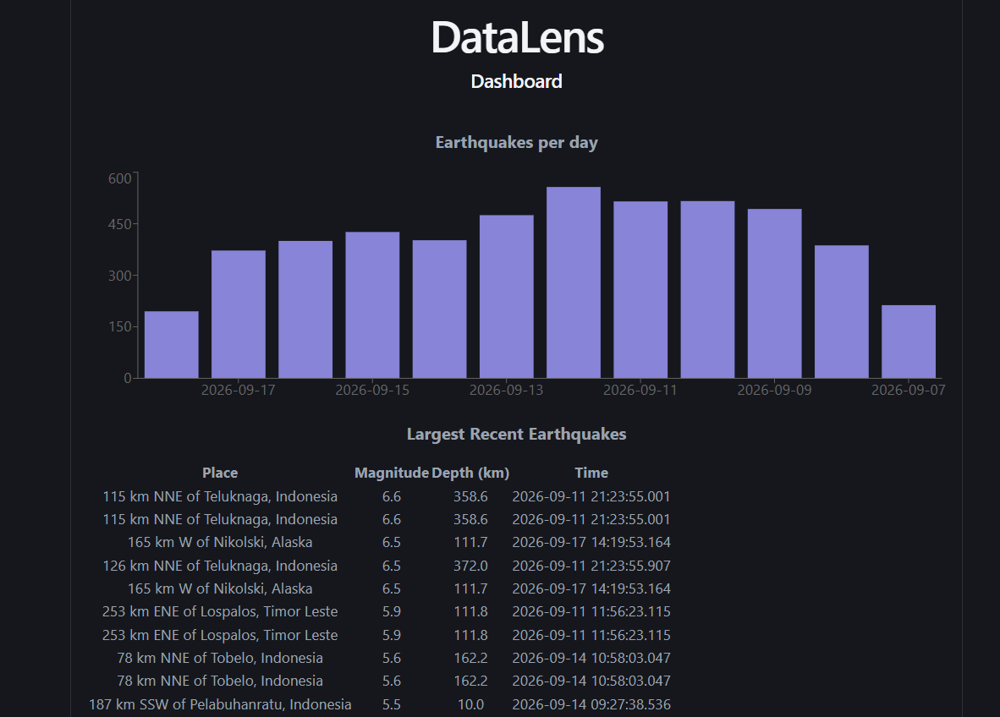
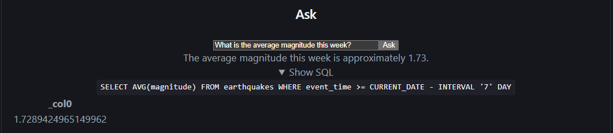
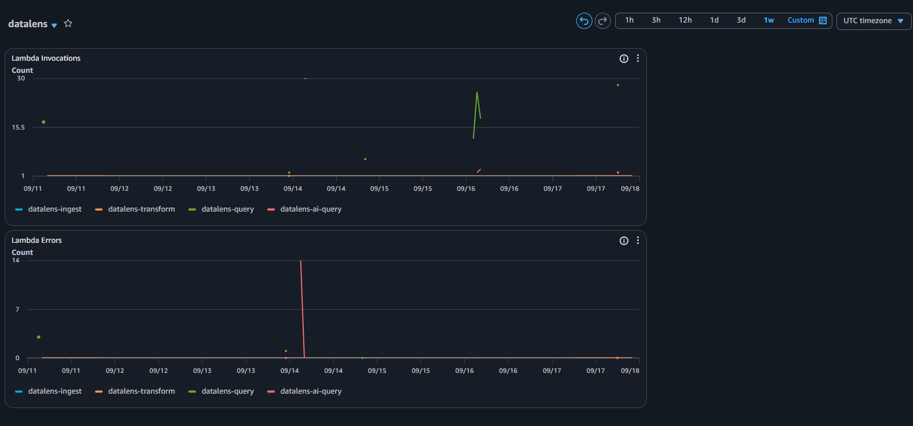

# DataLens

A serverless data pipeline that pulls live earthquake data from [USGS](https://earthquake.usgs.gov/earthquakes/feed/v1.0/summary/all_day.geojson) every 6 hours, cleans it, stores it as a proper data lake on S3, and lets you query it two ways: a dashboard with charts, or a plain-English question box powered by an LLM. Everything - ingestion, storage, the API, the AI layer, the frontend - runs on AWS, deployed entirely from Terraform.

I built this to actually learn cloud infrastructure and applied AI hands-on. It is a real live pipeline running on a schedule, a live API, a live site.

## Live Demo

[https://d2h2so545k2ja6.cloudfront.net](https://d2h2so545k2ja6.cloudfront.net)

## Screenshots

Dashboard:



Ask box:



CloudWatch monitoring:



## Architecture

```text
USGS earthquake feed
        |
        v
 [ingest Lambda]  <- runs every 6 hours (EventBridge)
        |
        v
 S3 bronze/  (raw JSON)
        |  new file triggers this automatically
        v
 [transform Lambda]  <- cleans it up, writes Parquet
        |
        v
 S3 gold/  ->  Glue Data Catalog  ->  Athena
                                        |
                    ------------------------------------
                    |                                  |
             [query Lambda]                    [ai_query Lambda]
             (fixed SQL per endpoint)      (Gemini writes the SQL)
                    |                                  |
                    ------------- API Gateway ----------
                                        |
                                        v
                              React frontend (S3 + CloudFront)

Cross-cutting: Terraform (all infra as code) . GitHub Actions (CI) . CloudWatch (alarm + dashboard)
```

## Tech Stack

| Layer        | Tech                                 | Why                                                                           |
| ------------ | ------------------------------------ | ----------------------------------------------------------------------------- |
| Ingestion    | AWS Lambda + EventBridge             | Serverless, runs on a schedule, no server to manage                           |
| Storage      | Amazon S3 (bronze/gold)              | The standard place to put a data lake                                         |
| Transform    | Lambda + Pandas + PyArrow            | Cleans raw JSON, dedupes, writes Parquet                                      |
| Catalog      | AWS Glue Data Catalog                | Gives Athena a schema to query against                                        |
| Query engine | Amazon Athena                        | Serverless SQL directly over S3, no database to run                           |
| API          | API Gateway + Lambda                 | Public REST API in front of Athena                                            |
| AI           | Google Gemini (free tier)            | Turns a plain-English question into SQL, and the results back into a sentence |
| Frontend     | React + Recharts, on S3 + CloudFront | The dashboard and ask box, hosted as a static site behind a CDN               |
| IaC          | Terraform                            | Every piece of AWS infra above is defined as code, not clicked together       |
| CI           | GitHub Actions                       | Runs the test suite and checks the Terraform on every push                    |
| Monitoring   | CloudWatch                           | An alarm on Lambda errors, plus a dashboard of invocations/errors             |
| Tests        | pytest                               | Unit tests on the data-cleaning logic                                         |

## How it works

Every 6 hours, EventBridge wakes up the **ingest** Lambda, which grabs the current USGS earthquake feed and drops the raw JSON straight into S3's `bronze/` folder, no processing at all. That new file landing in S3 automatically triggers the **transform** Lambda, which reads it with Pandas, drops any rows missing an id or magnitude, removes duplicate events, and writes the result as Parquet into `gold/`, partitioned by day.

From there, Glue's Data Catalog gives that Parquet data a schema, so Athena can run plain SQL over it - no database server involved, you're querying files sitting in S3 directly.

Two Lambdas sit behind API Gateway and both go through Athena, just differently:

- **query** runs one of three fixed SQL queries depending on which endpoint you hit (`/stats`, `/recent`, `/largest`).
- **ai_query** takes a typed-out question, sends it to Gemini along with the table's schema and a list of rules, gets back a SQL query, checks that query is actually safe (read-only, only touches this one table, no chained statements) before running it, and then asks Gemini a second time to turn the raw results into one plain sentence.

The React frontend just calls this same public API - it doesn't talk to AWS directly for anything.

## API

This is a small public API that lets you ask questions about earthquake data. It's backed by AWS Athena under the hood. Just hit one of the URLs below with a browser or curl and you'll get JSON back.

**Base URL:**

```text
https://66z1yldj84.execute-api.us-east-1.amazonaws.com/prod
```

Every endpoint below is a simple `GET` request — no login, no API key, nothing to set up. Just add the path to the base URL above.

---

### `GET /stats`

Gives you a quick daily summary: how many earthquakes happened, and how strong they were on average, grouped by day.

No parameters needed.

**Example:**

```bash
curl "https://66z1yldj84.execute-api.us-east-1.amazonaws.com/prod/stats"
```

**What you get back:**

```json
[
  { "dt": "2026-09-07", "num_events": "392", "avg_magnitude": "1.81" }
]
```

- `dt` — the date
- `num_events` — how many earthquakes were recorded that day
- `avg_magnitude` — the average strength of those earthquakes

---

### `GET /recent`

Gives you the most recent earthquakes, newest first.

**Parameter (optional):**

- `limit` — how many results you want back. If you don't pass this, default is 50.

**Example:**

```bash
curl "https://66z1yldj84.execute-api.us-east-1.amazonaws.com/prod/recent?limit=5"
```

**What you get back:** a list of earthquake records, each one looking like this:

```json
{
  "id": "aka2026rtrdfk",
  "magnitude": "1.2",
  "place": "32 km NE of Manley Hot Springs, Alaska",
  "event_time": "2026-09-07 22:49:47.981",
  "tsunami": "0",
  "longitude": "-150.137",
  "latitude": "65.205",
  "depth_km": "5.0",
  "dt": "2026-09-07"
}
```

- `magnitude` — how strong the earthquake was
- `place` — a human-readable description of where it happened
- `event_time` — when it happened (UTC)
- `tsunami` — `1` if a tsunami warning was tied to this event, otherwise `0`
- `longitude` / `latitude` — where it happened, as coordinates
- `depth_km` — how far below the surface it happened

---

### `GET /largest`

Same shape as `/recent`, but sorted by strength instead of time, the biggest earthquakes first.

**Parameter (optional):**

- `limit` — how many results you want back. If you don't pass this, defualt is 10.

**Example:**

```bash
curl "https://66z1yldj84.execute-api.us-east-1.amazonaws.com/prod/largest?limit=3"
```

**What you get back:** the same record shape as `/recent` above, just sorted differently.

---

### Notes:

- If you hit a path that doesn't exist, you'll get a `404` with a small JSON error message instead of a crash.
- If you call the exact same request twice within about 30 seconds, the second one will usually come back noticeably faster as results are cached briefly.
- All the number-looking fields (like `magnitude` or `num_events`) currently come back as text (e.g. `"1.2"` instead of `1.2`). That's a known quirk of how the underlying query engine returns data — if you're using these values in code, just convert them to numbers first.

## Running it locally

You need an AWS account, Terraform, Python 3.12, and Node.js.

1. Clone the repo and set up `infra/terraform.tfvars` with your own `bucket_name`, `gemini_api_key`, and `alert_email` (none of these are committed - see `infra/variables.tf` for what's required).
2. From `infra/`, run `terraform init` then `terraform apply` to deploy everything - S3, Lambdas, Glue, Athena setup, API Gateway, CloudWatch, and the CloudFront-hosted frontend.
3. Build and upload the frontend: `npm run build` inside `frontend/`, then `aws s3 sync frontend/dist s3://<your-bucket>-frontend`.
4. Run the tests locally with `pytest tests/ -v`.

Every command needed to develop, test, and deploy this project - including local Lambda testing and curl examples for each API endpoint - is documented with explanations in `commands.txt` at the repo root.

## Keeping it free

This entire project runs inside AWS's free tier:

- **Athena** charges $5 per TB scanned - at a few MB of data, thousands of queries still cost fractions of a cent.
- **Lambda, API Gateway, S3, Glue** all have free tiers well above what a portfolio project's traffic will ever hit.
- **Gemini's** free tier has no cost, just rate limits (which I hit once - see below).
- A **$5 AWS budget alarm** is set up separately as a safety net, so a runaway bill would email me before it became a real charge.

## What I learned

A few things stuck with me more than I expected going in:

- **Terraform's dependency graph isn't as smart as it looks.** Two resources that just happen to reference the same `resource_id`/`http_method` aren't a real dependency to Terraform - it'll happily try to create them in parallel and lose the race. I hit this twice (an S3 notification vs. a Lambda permission, and an API Gateway integration vs. its method) before it clicked that `depends_on` has to be explicit.
- **IAM errors are the least helpful errors in AWS.** "Access Denied" doesn't tell you which permission is missing. I ended up adding permissions one at a time as each specific Athena/Glue/S3 call failed, which is slow but does work.
- **"The code looks right but it's still broken" usually means the deployed code isn't the code you're looking at.** Lost a chunk of a session debugging a Lambda that appeared to ignore a fix I'd already written, before realizing I'd never re-run `terraform apply` after saving it.
- **Browsers do things behind the scenes that the server side doesn't warn you about.** A POST request with a JSON body triggers an invisible CORS preflight `OPTIONS` request first - if that route doesn't exist in API Gateway, the browser just reports "Failed to fetch" with zero useful detail.
- **An LLM will not reliably follow instructions in a prompt.** Telling it "never do X" in the prompt is not a guarantee - I validate the SQL it generates in actual code (must start with SELECT, no semicolons, only the one known table) rather than trusting the prompt alone.
- **Append-only pipelines create real duplicate data**, not just a hypothetical edge case. The same earthquake can get ingested more than once across separate 6-hour snapshots, sometimes with slightly revised details. Real data lakes solve this with upserts/merge-on-read; for this project, deduping by id at query time was the pragmatic choice.
- **Free-tier rate limits are a real constraint to design around**, not just a number on a pricing page - I hit Gemini's limit mid-test and had to add both spacing between requests and proper error handling for when it happens again.
